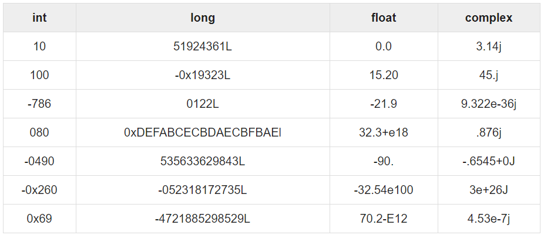
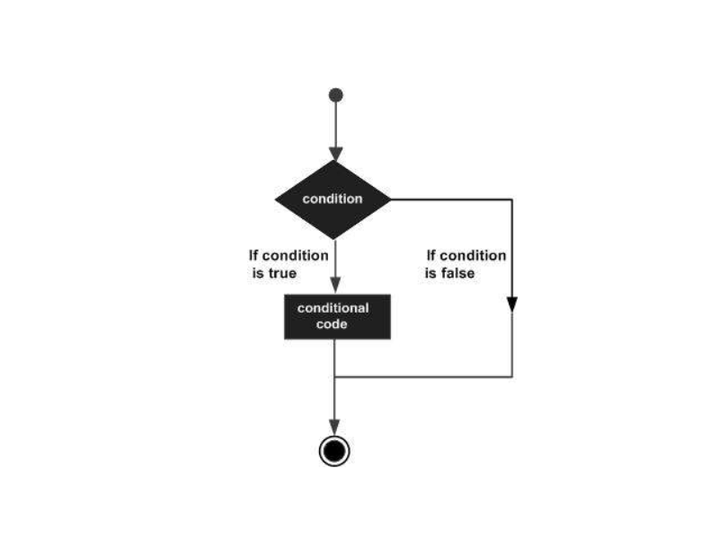

## What is Python?

> Python is a popular programming language.
> It was created by Guido van Rossum, and released in 1991.
>
>It is used for:
>
>* web development (server-side),
>* software development,
>* mathematics,
>* system scripting.

## What can Python do?

> * Python can be used on a server to create web applications.
>* Python can be used alongside software to create workflows.
>* Python can connect to database systems. It can also read and modify files.
>* Python can be used to handle big data and perform complex mathematics.
>* Python can be used for rapid prototyping, or for production-ready software development.

## Python - Variable Types

- #### Standard Data Types
  > * [Numbers](#python-numbers)
  >* [String](#python-strings)
  >* [List](#python-lists)
  >* [Tuple](#python-tuples)
  >* [Dictionary](#python-dictionary)

- #### Python Numbers
  > Number data types store numeric values. Number objects are created when you assign a value to them
  ```
   Example: 
      >>>var1 = 1
      >>>var2 = 10

   Python supports four different numerical types −
      * int (signed integers)
      * long (long integers, they can also be represented in octal and hexadecimal)
      * float (floating point real values)
      * complex (complex numbers)
  ```
  

- #### Python Strings
  > Strings in Python are identified as a contiguous set of characters
  > represented in the quotation marks. Python allows for either pairs
  > of single or double quotes. Subsets of strings can be taken using
  > the slice operator ([ ] and [:] ) with indexes starting at 0 in
  > the beginning of the string and working their way from -1 at the end
    ```
    >>>str = 'Hello World!'

    >>>print(str)                # Prints complete string
    Hello World!

    >>>print(str[0])             # Prints first character of the string
    H 

    >>>print(str[2:5])           # Prints characters starting from 3rd to 5th
    llo

    >>>print(str[2:])            # Prints string starting from 3rd character
    llo World!

    >>>print(str * 2)          # Prints string two times
    Hello World!Hello World!

    >>>print(str + "TEST")     # Prints concatenated string
    Hello World!TEST
    ```

- #### Python Lists
  > Lists are the most versatile of Python's compound data types.
  > A list contains items separated by commas and enclosed within square brackets ([]).
  > To some extent, lists are similar to arrays in C. One difference between
  > them is that all the items belonging to a list can be of different data type.
  >
  >The values stored in a list can be accessed using the
  > slice operator ([ ] and [:]) with indexes starting at 0 in the
  > beginning of the list and working their way to end -1.
  > The plus (+) sign is the list concatenation operator,
  > and the asterisk (*) is the repetition operator
     ```
     >>>list = ['abcd', 786 , 2.23, 'john', 70.2]
     >>>tinylist = [123, 'john']
         
     >>>print list                      # Prints complete list
     ['abcd', 786, 2.23, 'john', 70.2]
         
     >>>print list[0]                  # Prints first element of the list
     abcd
         
     >>>print list[1:3]                 # Prints elements starting from 2nd till 3rd
     [786, 2.23]
         
     >>>print list[2:]                  # Prints elements starting from 3rd element
     [2.23, 'john', 70.2]
         
     >>>print tinylist * 2              # Prints list two times
     [123, 'john', 123, 'john']
         
     >>>print list + tinylist           # Prints concatenated lists
     ['abcd', 786, 2.23, 'john', 70.2, 123, 'john']
     ```
- #### Python Tuples
  > A tuple is another sequence data type that is similar to the list.
  > A tuple consists of a number of values separated by commas.
  > Unlike lists, however, tuples are enclosed within parentheses.
  >
  >The main differences between lists and tuples are:
  > Lists are enclosed in brackets ( [ ] ) and their elements and size can be changed,
  > while tuples are enclosed in parentheses ( ( ) ) and cannot be updated.
  > Tuples can be thought of as read-only lists

     ```
     >>>tuple = ('abcd', 786 , 2.23, 'john', 70.2)
     >>>tinytuple = (123, 'john')
     
     >>>print tuple               # Prints the complete tuple
     ('abcd', 786, 2.23, 'john', 70.2)
     
     >>>print tuple[0]            # Prints first element of the tuple
     abcd
     
     >>>print tuple[1:3]          # Prints elements of the tuple starting from 2nd till 3rd 
     (786, 2.23)
     
     >>>print tuple[2:]           # Prints elements of the tuple starting from 3rd element
     (2.23, 'john', 70.2)
     
     >>>print tinytuple * 2       # Prints the contents of the tuple twice
     (123, 'john', 123, 'john')
     
     >>>print tuple + tinytuple   # Prints concatenated tuples
     ('abcd', 786, 2.23, 'john', 70.2, 123, 'john')
     ```
- #### Python Dictionary
  > Python's dictionaries are kind of hash table type.
  > They work like associative arrays or hashes found in Perl
  > and consist of key-value pairs. A dictionary key can be
  > almost any Python type, but are usually numbers or strings.
  > Values, on the other hand, can be any arbitrary Python object.
  >
  >Dictionaries are enclosed by curly braces ({ })
  > and values can be assigned and accessed using square braces ([])
     ```
     dict = {}
     dict['one'] = "This is one"
     dict[2]     = "This is two"
     
     tinydict = {
       'name': 'john',
       'code':6734, 
       'dept': 'sales'
     }

     >>>print dict['one']        # Prints value for 'one' key
     This is one
   
     >>>print dict[2]            # Prints value for 2 key
     This is two
   
      >>>print tinydict          # Prints complete dictionary
     {'dept': 'sales', 'code': 6734, 'name': 'john'}
   
     >>>print tinydict.keys()    # Prints all the keys
     ['dept', 'code', 'name']
   
     >>>print tinydict.values()  # Prints all the values
     ['sales', 6734, 'john']
     ```

## Python - Basic Operators

> Python language supports the following types of operators.
>
>* Arithmetic Operators (+, -, *, /, %, **, //)
>* Comparison (Relational) Operators(==, !=, <, >, <=, >=)
>* Assignment Operators (=, +=, -=, *=, /=, %, **=, //=)
>* Logical Operators (and, or, not)
>* Bitwise Operators (&, |, ^, ~, <<, >>)
>* Membership Operators (in, not in)
>* Identity Operators (is, not is)

## Python - Decision Making

> Decision making is anticipation of conditions occurring
> while execution of the program and specifying
> actions taken according to the conditions.
>
>Decision structures evaluate multiple expressions
> which produce TRUE or FALSE as outcome. You need to
> determine which action to take and which statements
> to execute if outcome is TRUE or FALSE otherwise



```
>>>var = 100
>>>if var == 100: print "Value of expression is 100"
```

## Python - Loops

> Python programming language provides following types of loops to handle looping requirements.
>   * while loop: Repeats a statement or group of statements while a given condition is TRUE. It tests the condition before executing the loop body.

```
while expression:
    statement(s)

Ex:
    count = 0
    while (count < 5):
       print('The count is:', count)
       count += 1

    Output:
        The count is: 0
        The count is: 1
        The count is: 2
        The count is: 3
        The count is: 4
```

> * for loop: Executes a sequence of statements multiple times and abbreviates the code that manages the loop variable

```
for iterating_var in sequence:
    statements(s)

Ex:
    fruits = ['banana', 'apple',  'mango']
    for fruit in fruits:        # Second Example
       print(fruit)
    
    Output:
        banana
        apple
        mango
```

> * nested loops: You can use one or more loop inside any another while, for or do..while loop

```
for iterating_var in sequence:
   for iterating_var in sequence:
      statements(s)
   statements(s)
   
Ex:
    for i in range(0, 10):
        for j in range(i, 10):
            print(j, end=" ")
        print("")
    
    Output:
        0 1 2 3 4 5 6 7 8 9 
        1 2 3 4 5 6 7 8 9 
        2 3 4 5 6 7 8 9 
        3 4 5 6 7 8 9 
        4 5 6 7 8 9 
        5 6 7 8 9 
        6 7 8 9 
        7 8 9 
        8 9 
        9 

while expression:
   while expression:
      statement(s)
   statement(s)
   
Ex:
    i = 1
    while i <= 10:
        j = 1
        while j <= 10 - i:
            print(j, end=" ")
            j += 1
        print("")
        i += 1
    
    Output:
        1 2 3 4 5 6 7 8 9 
        1 2 3 4 5 6 7 8 
        1 2 3 4 5 6 7 
        1 2 3 4 5 6 
        1 2 3 4 5 
        1 2 3 4 
        1 2 3 
        1 2 
        1 
```

## Python - Functions

> A function is a block of organized,
> reusable code that is used to perform a single, related action.
> Functions provide better modularity for your application and a high degree of code reusing

- #### Syntax
   ```
   def func_name(param...):
      #code

   Ex:
   def say(str):
       print(str)
   ```

- #### Calling a Function:
   ```
   Ex:
       def say(str):
           print(str)
       
       say("hello")
       hello
  ```
- #### Function Arguments
    - ###### Required arguments
   ```
       # Function definition is here
       def printme(str):
          "This prints a passed string into this function"
          print(str)
          return
       
       # Now you can call printme function
       printme()
       
       Output:
           Traceback (most recent call last):
              File "test.py", line 11, in <module>
                 printme();
           TypeError: printme() takes exactly 1 argument (0 given)
   ```
    - ###### Keyword arguments
   ```
       def printme(str):
          "This prints a passed string into this function"
          print(str)
          return
       
       # Now you can call printme function
       printme(str = "My string")
       
       Output:
       My string
   ```
    - ###### Default arguments
   ```
        def printinfo(name, age=35):
            "This prints a passed info into this function"
            print("Name: ", name)
            print("Age ", age)
            return

        # Now you can call printinfo function
        printinfo(age=50, name="miki")
        printinfo(name="miki")

        Output:
        Name:  miki
        Age  50

        Name:  miki
        Age  35
   ```
    - ###### Variable-length arguments
   ```
      def get_sum(arg, *num, **nums):
        print(arg)
        print(num)
        print(nums)
    
      get_sum(1, 2, 3, 4, 5, a='23')
      Output:
        1
        (2, 3, 4, 5)
        {'a': '23'}
   ```